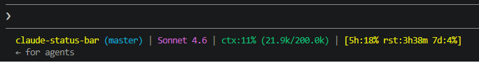

# claude-status-bar

Custom status line for [Claude Code](https://claude.ai/code) showing folder, git branch, model, context usage, and rate limits.



Just needs Python 3 and git on PATH (if you want the branch segment to show)
## Install

**Mac / Linux**
```bash
curl -fsSL https://raw.githubusercontent.com/Scr1ptW0lf/claude-status-bar/master/install.py | python3
```

**Windows (PowerShell)**
```powershell
(Invoke-WebRequest https://raw.githubusercontent.com/Scr1ptW0lf/claude-status-bar/master/install.py).Content | python
```

You may need to restart Claude Code after installing.

## What it shows

```
project-name (main) | Sonnet 4.6 | ctx:12% (24.3k/200k) | [5h:34% rst:2h15m 7d:8%]
```

| Segment | Description |
|---|---|
| `project-name (main)` | Current folder and git branch |
| `Sonnet 4.6` | Active model |
| `ctx:12%` | Context window used (tokens used / total) |
| `[5h:34% rst:2h15m]` | 5-hour rate limit usage and time until reset |
| `[7d:8%]` | 7-day rate limit usage |

Colors shift to red when context or rate limits are above 80%.

I wonder how many of these repos exist on GitHub...